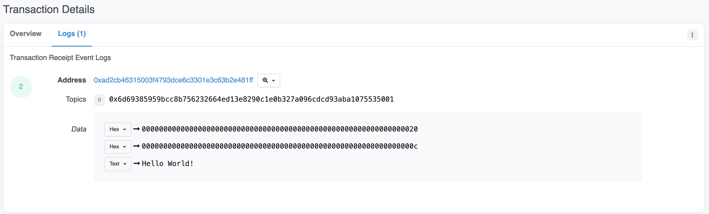
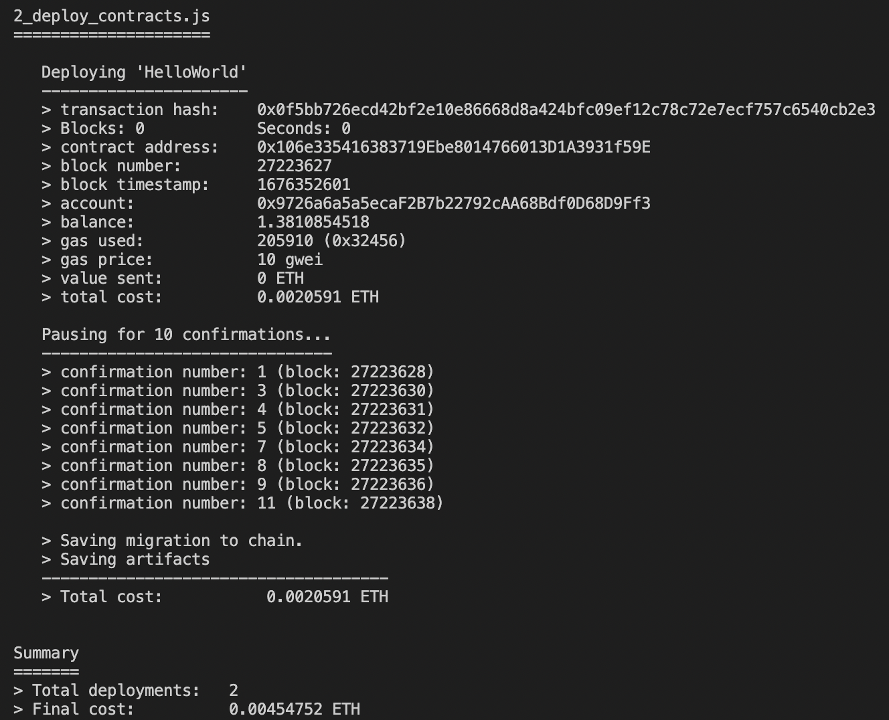
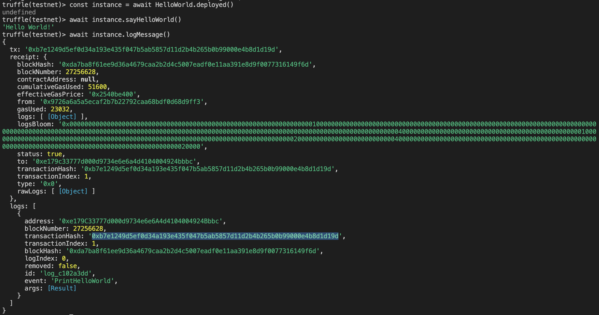

# Hello World

In this page, we will demonstrate:
- How to create a simple Smart Contract that both logs and prints the `Hello World!` message by creating the HelloWorld.sol file 
- Compile, migrate to the BNB Smart Chain testnet network and test your smart-contract with truffle.

During the demonstration, we’ll also cover some basic Solidity code that will help you write your own smart contracts.


## Settings

To deploy this contract, the following settings are required:
- Node v18.14.0: [Node Page](https://nodejs.org/en/download/)
- Truffle v5.4.18 (core: 5.4.18):
    - `npm install -g truffle@5.4.18`
    - [Truffle page](https://trufflesuite.com/docs/truffle/how-to/install/)
- Metamask Account:
    - [MetaMask For BNB Smart Chain](https://docs.bnbchain.org/docs/wallet/metamask/)

**Notes**:
- For this project, we decided to use these versions of Nodejs and Truffle. Later versions may work;
- If you run an M1 OS and encounter an error `Are you connected to the internet?`, read the following chat: [M1 'truffle-nodejs' issue](https://github.com/trufflesuite/truffle/issues/4431#issuecomment-969520019);
- Don't forget to add BNB testnet tokens to your Metamask account before migrating the smart-contract ([Airdrop website](https://testnet.bnbchain.org/faucet-smart));
- We chose to use Truffle to deploy our contract, but there are other methods available for deploying and compiling contracts. You can find more information on alternative methods on this [website](https://docs.bnbchain.org/docs/bsc-tutorials#smart-contracts).
- One of the requirements to deploy a smart contract is to use a Software Package Data Exchange (SPDX) licence. SPDX is a standard for communicating software licenses in a machine-readable format. You can find more information on the different free SPDX on this [website](https://spdx.org/licenses/).


## Initiation

To get started, we'll need to create a new smart-contract file called `HelloWorld.sol`. You can do this by opening a new directory and creating a file with that name. In this file, we'll need to specify which compiler version we want to use for our Solidity code:

```
pragma solidity ^0.8.18;
```
[compiler version](../contracts/HelloWorld.sol#l4)
We are using the version 0.8.18 for this contract as it is the current latest solidity compiler version ([February 2023](https://blog.soliditylang.org/2023/02/01/solidity-0.8.18-release-announcement/)). 

To ensure the highest level of security, we follow the [official recommendation](https://docs.soliditylang.org/en/latest/index.html#solidity) and use the latest released version of Solidity.

## 1 - Create Smart-contract HelloWorld

### 1.1 - Name the contract

To create a new contract, we will have to write the following line:
```
contract HelloWorld {}
```
[contract line](../contracts/HelloWorld.sol#l6)

This line defines the `HelloWorld` contract. The contract's functions and variables will be written within the curly braces following the contract name.


### 1.2 - Create the Hello World Function

For the first function, we will return a straightforward message `Hello World!` by creating a pure function:
```
function sayHelloWorld() public pure returns (string memory) {
    return "Hello World!";
}
```
[sayHelloWorld function](../contracts/HelloWorld.sol#l22)

We also need to declare the type of variable that will be returned and specify the location of the function's return value.


#### Pure function

In Solidity, a pure function is a type of function that does not read from or modify the state of the contract. It only returns a value based on its inputs. The term "pure" refers to the fact that the function's behavior is predictable and does not change the contract's state. Pure function can't therefore read immutable variables.

In our case, the function doesn't receive any input and always returns `Hello World!`.


#### Public Function

To allow access to the function from outside the contract, we declared it as public. Public functions are accessible from outside the contract, meaning they can be called by other contracts and by users directly.


#### Solidity Types

The function type being declare, we now need to specify the location and the type  of the function's return value.
Different types can be returned from a solidity function. For the function `sayHelloWorld`, we will return a string.


#### Location Types

Every reference type has an additional annotation, the “data location”, about where it is stored. There are three data locations:
- `calldata`: The return value is stored in the function call data, which is used to pass parameters to functions. When a value is stored in calldata, it is only accessible during the current function call, and is automatically cleared once the function returns.
- `memory`: The return value is stored in the memory storage area of the contract. When a value is stored in memory, it can be accessed by subsequent function calls, but it is automatically cleared once the function returns.
- `storage`: The return value is stored in the long-term storage area of the contract. When a value is stored in storage, it can persist even after the function returns, and can be accessed by subsequent function calls.

In our situation, `Hello World!` being a string that we don't want to store in the contract, we set the return value as a string stored in the memory: `string memory`.

When calling the `sayHelloWorld` function, the string `Hello World!` should be returned.


### 1.3 - Create a Log function

In this second example, we will use solidity's events.


#### Events

[Events](https://docs.soliditylang.org/en/latest/contracts.html#events) in Solidity are inheritable members of the contract, which log or track changes in the state of a contract. They can be thought of as a mechanism to broadcast information from a contract to the outside world, allowing external entities to listen for and respond to these events.

Events are defined within a contract and can be emitted or triggered by its functions. When an event is emitted, it is logged in the blockchain and can be accessed by clients listening for events on the contract. These logs are associated with the address of the contract, are incorporated into the blockchain, and stay there as long as a block is accessible. The Log and its event data is not accessible from within contracts (not even from the contract that created them). 

Events are often used for logging purposes, to notify interested parties of changes in the state of a contract, or to communicate the results of transactions to external clients. It is also a cheap data storage.


#### Events best practices

To ensure clarity and maintain efficient performance, we need to follow a few conventions:
- Event names in Solidity should be clear and descriptive (e.g.`event AccountsChanged(address indexed from, bytes32 indexed to);`)
- Parameters of events should be of basic data types and avoid including sensitive information (e.g. Primitive Types)
- Use them judiciously as excessive use of events can lead to storage and performance problems.


The `logMessage()` function using the event in our contract will be looking like the following:
```
event PrintHelloWorld(string message);

function logMessage() public {
    emit PrintHelloWorld("Hello World!");
}
```
[logMessage function](../contracts/HelloWorld.sol#l8)

**Notes**: Keep in mind that parameters of events can be of type `indexed`. This can be helpful for efficiently searching for event logs based on the value of the `indexed` parameter.

We create an event called `PrintHelloWorld`. The event parameters are placed inside parentheses. The `message` parameter, declared as type `string`, will be passed to the event. Since there is only one parameter, it does not need to be indexed.
Then, in the function `logMessage`, we emit the event `PrintHelloWorld` by passing the string `Hello World!`. 

When we call the function `logMessage`, we will receive a transaction. You can check the transaction info in the [`bsc testnet explorer`](https://testnet.bscscan.com/) by pasting the `transactionHash`. The log message should be visible in the `Logs` header:



### 1.4 - Create a function that combines log and Hello Word functions

Here's an example of combining the two functions into one:
```
event PrintHelloWorld(string message);

function logAndReturnHelloWorld() public returns (string memory) {
    emit PrintHelloWorld("Hello World!");
    return "Hello World!";
}
```
[logAndReturnHelloWorld function](../contracts/HelloWorld.sol#l31)

The function will create a transaction to log the message and will return the string `Hello World!`.
As we read the state of the contract to call the event function, the `logAndSayHelloWorld` function can't be pure.


To view the full code of the `Helloworld` smart-contract, navigate to the `contracts` folder: [HelloWorld](../contracts/HelloWorld.sol)


## 2 - Compile and Migrate the contract

### 2-1 - Initialisation

At first, create a new truffle architecture in the directory that will contain your contract by running the following command:
```
truffle init
```

If we didn't receive an error, the architecture should look like the following:
```bash
├── contracts
│   └── Migrations.sol
├── migrations
│   └── 1_initial_migration.js
├── test
└── truffle-config.js
```

- `contracts` folder stores the contracts;
- `migrations` folder holds the migration files that are responsible for deploying the compiled contracts to the network of choice; 
- `test` folder has all the files to validate that the contracts perform as expected;
- `truffle-config.js` file outlines the settings for the development environment, such as the network to deploy the smart contract to, the location of the contract files, and any other necessary configuration options for Truffle. This file is a crucial part of the project if we want to use Truffle, as it provides the information required for Truffle to compile, build, test, and deploy the smart contracts.

`Migrations.sol` and `1_initial_migration.js` are files that were generated by the truffle initialization command. You can keep them as they are essential for compiling and migrating your new contract.
`Migrations.sol` file - contract serves as a special purpose contract that tracks the state of migrations. 
`1_initial_migration.js` file - is the first migration script that is used to deploy the `Migrations.sol` contract to the blockchain. 

Later, you can use the `Migrations.sol` when you deploy your new contract to ensure that the migrations have been completed successfully before deploying your new contract. You will have to import the `Migrations.sol` in your new contract file and make the new contract inherit from the `Migrations` contract using the is keyword. In our example, we will not use it.


### 2.2 - Configuration

Before compiling and migrating the contracts, we need to set the configuration in the `truffle-config.js`, install the dependencies and add the metamask information.


#### Imports

In the `truffle-config.js`, uncomment the following lines:
```
const HDWalletProvider = require('@truffle/hdwallet-provider');
const fs = require('fs');
const mnemonic = fs.readFileSync(".secret").toString().trim();
```

- `@truffle/hdwallet-provider` is a module in the Truffle framework that provides a convenient way to sign transactions with a mnemonic seed phrase and HD (Hierarchical Deterministic ) wallet. It allows users to use their mnemonic seed phrase to securely connect to `BNB Smart Chain` and sign transactions with a private key derived from the seed phrase. This makes it easy to manage multiple addresses and sign transactions from a dapp or script, without having to manage the private keys directly. 

To use this module, run the following command:
```
sudo npm install @truffle/hdwallet-provider
```

- `fs` is a built-in module in Node.js for file system operations;

- The `mnemonic` variable is a sequence of words that represents a seed phrase used to recover the private key of a cryptocurrency wallet. This type of phrase is commonly referred to as a recovery phrase or backup phrase. In our case, we'll be storing the `metamask` seed phrase in the `.secret` file in the root directory.

**Notes**:
- To retrieve your metamask mnemonic, you can refer to this [website](https://metamask.zendesk.com/hc/en-us/articles/360015290032-How-to-reveal-your-Secret-Recovery-Phrase); 
- As general rule, it's important to keep your seed phrase secure, especially if you're using your project for business purposes. You can either store your seed phrase in an encrypted configuration file that is separate from the codebase (e.g. Hashicorp's Vault or AWS Key Management Service), or follow the [Truffle recommendation](https://trufflesuite.com/blog/introducing-truffle-dashboard/);
- Don't forget to add the BSC testnet network by following the instructions provided in this [link](https://docs.bnbchain.org/docs/wallet/metamask/#connect-your-metamask-with-bnb-smart-chain);
- If you don't have any BNB tokens in your MetaMask account, you can use the [following website](https://testnet.bnbchain.org/faucet-smart) to airdrop tokens to your account.


#### Networks

In the `networks` section, we will have to declare the different network we will use for the project. Write the following lines:
```
development: {
    host: "127.0.0.1",
    port: 8545,
    network_id: "*",
},
testnet: {
    provider: () => new HDWalletProvider(mnemonic, `https://data-seed-prebsc-2-s1.binance.org:8545`),
    network_id: 97,
    confirmations: 10,
    timeoutBlocks: 200,
    skipDryRun: true
},
bsc: {
    provider: () => new HDWalletProvider(mnemonic, `https://bsc-dataseed1.binance.org`),
    network_id: 56,
    confirmations: 10,
    timeoutBlocks: 200,
    skipDryRun: true
},
```

In this project, we will only use the testnet network. The `BNB Smart Chain` test network use different endpoints. Here is a list of them:

``` bash
https://data-seed-prebsc-1-s1.binance.org:8545
https://data-seed-prebsc-2-s1.binance.org:8545
https://data-seed-prebsc-1-s2.binance.org:8545
https://data-seed-prebsc-2-s2.binance.org:8545
https://data-seed-prebsc-1-s3.binance.org:8545
https://data-seed-prebsc-2-s3.binance.org:8545
```

If you receive the following error too many times, you can replace the endpoint by another one:
``` bash
Error: Unhandled error. ({
  code: -32603,
  message: 'getaddrinfo ENOTFOUND data-seed-prebsc-2-s1.binance.org',
  data: {
    originalError: {
      errno: -3008,
      code: 'ENOTFOUND',
      syscall: 'getaddrinfo',
      hostname: 'data-seed-prebsc-2-s1.binance.org'
    }
  }
})
```

Finally, you will have to set the solidity compiler version used for the project in the `solc` compilers. In our project, it will be the 0.8.18:
```
compilers: {
    solc: {
      version: "0.8.18",
    }
},
```


### 2.3 - Compile

Now that the configuration are ready, we can import our contract [HelloWorld](../contracts/HelloWorld.sol). To compile the contract, run the following command:  
```
truffle compile
```

If everything works well, we should see the following result:
```
Compiling your contracts...
===========================
> Compiling ./contracts/HelloWorld.sol
> Compiling ./contracts/Migrations.sol
> Artifacts written to /Users/user/Documents/bsc-smart-contract-tutorial-test/build/contracts
> Compiled successfully using:
   - solc: 0.8.18+commit.87f61d96.Emscripten.clang
```

A new folder called `build` should have been created containing the `HelloWorld` and `Migrations` artifacts. These artifacts will be used for the next steps.


### 2.4 - Migrate

As we generated the contract's artifacts, we can now migrate the contract. Let's create a new file called `2_deploy_contracts.js` in the `migrations` folder. This file will be in charge to deploy the contracts's artifact to the Blockchain network. In the file, paste the following lines:
```
const HelloWorld = artifacts.require("HelloWorld");

module.exports = function(deployer) {
    deployer.deploy(HelloWorld);
}
```
The `Deployer` variable is the Truffle wrapper for deploying contracts to the network.

When the file is ready, run the following command:
```
truffle migration --network testnet
```
The command will ask for the migration file to deploy the contracts to the `BNB Smart Chain testnet`.

If everything is fine, you should see the following result:



## 3 - Test the contract

### 3.1 - Console Test

Once your migration is complete, you can test your deployed smart contract using the Truffle console. To access the Truffle environment, run the following command:
```
truffle console --network testnet
```
This will connect you to the `BNB Smart Chain testnet`.

Next, retrieve your deployed `HelloWorld` smart contract:
```
const instance = await HelloWorld.deployed()
```

Now, let's test the `sayHelloWorld` function of our smart-contract by compiling the function:
```
await instance.sayHelloWorld()
```

You can then test the `logMessage` function as well:
```
await instance.logMessage()
```

You can check the transaction info in the [`bsc testnet explorer`](https://testnet.bscscan.com/) by pasting the `transactionHash`.


From all these command, you should see the following result:



### 3.2 - Test functions

We can test our function by writing test cases in a separate file. Truffle uses the [Mocha](https://mochajs.org/) testing framework and [Chai](https://www.chaijs.com/) for assertions. This way, we can ensure that our function works as expected.

After the migration of the contract, add a new javascript file in the `tests` directory that will be called `hello_world.js`. In this file, we will add the following test functions that will test `sayHelloWorld()` and `logMessage()` functions:
```
const HelloWorld = artifacts.require("HelloWorld");

contract('HelloWorld', function () {
    let instance;
    before(async () => {
        instance = await HelloWorld.deployed();
    });

    it('Should return `Hello World!`', async () => {
        let message = await instance.sayHelloWorld();
        assert.equal(message, 'Hello World!');
    });

    it('Should emit the event `PrintHelloWorld`', async () => {
        let log = await instance.logMessage();
        assert.equal(log.logs[0].event, 'PrintHelloWorld');
    })
})
```

To run these test functions, we use the following command to compile the test file:
```
truffle test --network testnet
```

**Notes**: This will not work if your contract was not migrated before running the tests.


## 4 - Conclusion

If you followed each instruction and everything went well, you should have the following architecture:

```bash
├── build
│   └── contracts
│       ├── HelloWorld.json
│       └── Migrations.json
├── contracts
│   ├── HelloWorld.sol
│   └── Migrations.sol
├── migrations
│   ├── 1_initial_migration.js
│   └── 2_deploy_contracts.js
├── package-lock.json
├── package.json
├── test
│   └── hello_world.js
└── truffle-config.js
```

In this page, you have learned some basic knowledge on how to create a `helloworld` smart-contract and deploy it. In the next section, we will explore how to create tokens and exchange them.